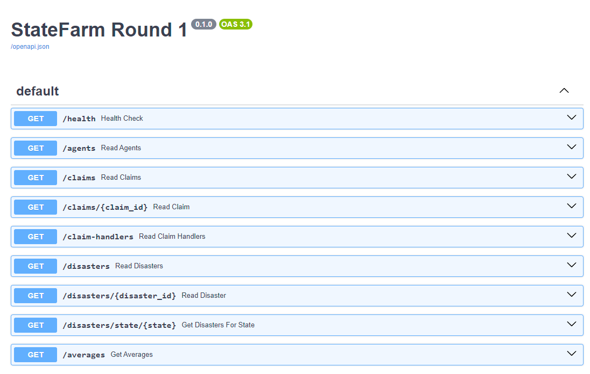

# 2023 State Farm Coding Competition - Round 1



### Installation
1. Install, ideally, Python 3.10 or later. You can download it [here](https://www.python.org/downloads/release/python-31012/).
2. Clone the repository:
```
git clone https://github.com/cullenwatson/2023-StateFarm-CodingCompetition.git
cd 2023-StateFarm-CodingCompetition
```

3. Install the necessary packages:
```
pip install -r requirements.txt
```

4. Run the API:
```
python api.py
```

Once the API is running, navigate to `http://127.0.0.1:8010/docs` in your browser to interact with the API.
